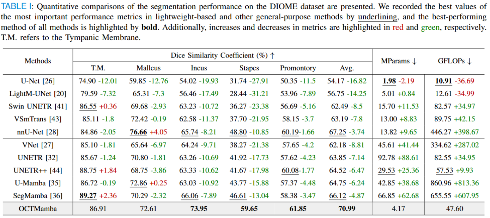

# OCTMamba: A Lightweight Ear Segmentation Framework for 3D Portable Endoscopic OCT Scanner

🎉 This work is published in [Expert Systems with Applications](https://doi.org/10.1016/j.eswa.2026.131678)

[](https://huggingface.co/deepang/octmamba)&nbsp;


# Network Architecture


**Figure 1.** An overview of the OCTMamba network architecture.


## Training

To reproduce results or train OCTMamba on your data, follow the standard nnU-Net v2 training pipeline. OCTMamba is designed to run as an extension within the nnU-Net framework.

1) Environment configuration

- Install PyTorch first, then run the project setup script:
  ```bash
  pip install torch
  sh setup-env.sh
  ```

2) Dataset preparation (nnU-Net v2 format)

- Prepare datasets strictly following the nnU-Net v2 documentation (dataset structure, JSON metadata, and case naming conventions). Refer to the dataset specification here: [nnU-Net v2 Dataset Format](nnUNet/documentation/dataset_format.md). Set the nnU-Net paths before preprocessing:
  ```bash
  export nnUNet_raw=/path/to/nnUNet_raw
  export nnUNet_preprocessed=/path/to/nnUNet_preprocessed
  export nnUNet_results=/path/to/nnUNet_results
  ```
  For details on setting these paths, see: [setting_up_paths.md](nnUNet/documentation/setting_up_paths.md).
* Create the dataset folder `nnUNet_raw/DatasetXXX_MyDataset` with imagesTr, labelsTr (and imagesTs if applicable) as required by nnU-Net v2. Then run fingerprinting and planning for 3d_fullres:

  ```bash
  nnUNetv2_extract_fingerprint -d XXX
  nnUNetv2_plan_and_preprocess -d XXX -c 3d_fullres
  ```

  Replace `XXX` with your numeric dataset ID.

3. Training with OCTMamba trainer

    ```bash
    nnUNetv2_train XXX 3d_fullres 0 -tr nnUNetTrainerOCTMamba
    ```
  Notes

  - The trainers are defined in [nnUNet/nnunetv2/training/nnUNetTrainer/variants/octmamba/OCTMambaTrainer.py](nnUNet/nnunetv2/training/nnUNetTrainer/variants/octmamba/OCTMambaTrainer.py)
  - The OCTMamba model architecture is defined in [nnUNet/nnunetv2/nets/OCTMamba.py](nnUNet/nnunetv2/nets/OCTMamba.py).
  - Always use the `3d_fullres` configuration for training OCTMamba to match the intended design and reported results.


# Data Description

## Dataset Name: DIOME (Dresden in vivo OCT Dataset of the Middle Ear)

Modality: 3D in vivo OCT

Size: 43 volumes (29 subjects)

* Access the dataset from the link below, then copy the volumes into `nnUNet_raw/DatasetXXX_MyDataset/imagesTr` and the labels into `nnUNet_raw/DatasetXXX_MyDataset/labelsTr` (following nnU-Net v2 naming rules):
[DIOME Dataset](https://opara.zih.tu-dresden.de/xmlui/handle/123456789/6047)
* Download the JSON file and place it in the same folder as the dataset.

## Dataset Name: Inner Ear Dataset

Modality: CT

Size: 341 3D volumes (271 Training + 70 Validation)

* Access the dataset from the link below, then copy the volumes into `nnUNet_raw/DatasetXXX_MyDataset/imagesTr` and the labels into `nnUNet_raw/DatasetXXX_MyDataset/labelsTr` (following nnU-Net v2 naming rules):
[Inner Ear Dataset](https://ieee-dataport.org/documents/ct-training-and-validation-series-3d-automated-segmentation-inner-ear-using-u-net)
* Download the JSON file and place it in the same folder as the dataset.

# Benchmark

## DIOME Dataset

Performance comparative analysis of different network architectures for middle ear segmentation in the DIOME dataset.



## Inner Ear Dataset

Performance comparative analysis of different network architectures for inner ear segmentation.


# Visualization

## DIOME Dataset

Qualitative visualizations of OCTMamba and baseline approaches for the middle ear segmentation task.


## Inner Ear Dataset

Qualitative visualizations of OCTMamba and baseline approaches for the inner ear segmentation task.


# Citation

If you find this repository useful, please cite:

```bibtex
@article{huang2026octmamba,
  title={OCTMamba: A Lightweight Ear Segmentation Framework for 3D Portable Endoscopic OCT Scanner},
  author={Jiahui Huang and Junming Yan and Qiong Wang and Qingjie Meng and Jinpeng Li and Yan Pang},
  journal={Expert Systems with Applications},
  pages={131678},
  year={2026},
  publisher={Elsevier},
  keywords = {3D Medical Segmentation, On-device Model, Resource-limited Application, Endoscopic OCT},
  doi={10.1016/j.eswa.2026.131678}
}
```

# License

This project is licensed under the MIT License. See [LICENSE](https://github.com/deepang-ai/OCTMamba/blob/main/LICENSE) for details.
