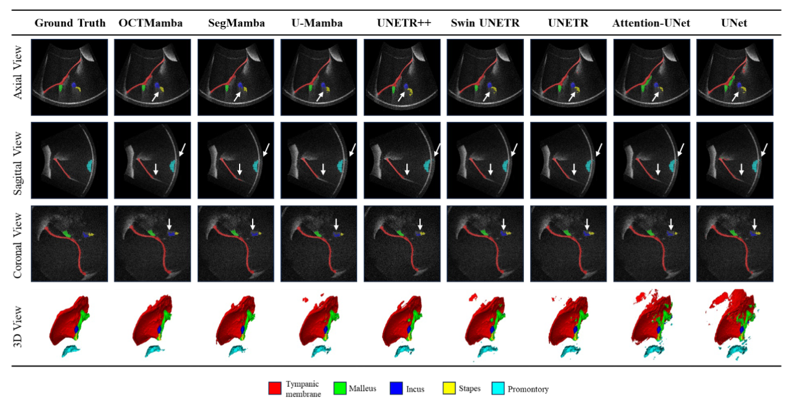

# OCTMamba: A Lightweight Middle Ear Segmentation Framework for 3D Portable Endoscopic OCT Scanner

> More details of this project will be released soon.

# Network Architecture
The OCTMamba framework is engineered as an advanced encoder-decoder architecture optimized for capturing features at various scales through hierarchical representation learning. This framework is particularly adept at processing complex medical images of the middle ear, aiming to achieve detailed and accurate segmentation. As illustrated in overview, the process begins with the feature extractor, which employs two consecutive convolution layers, each enhanced with instance normalization and GELU activation functions, to refine and deepen the quality of representations from the 3D vivo OCT of the middle ear.

# Data Description
Dataset Name: [DIOME](https://www.nature.com/articles/s41597-024-03000-0)

Modality: OCT

Download the dataset from this [link](https://opara.zih.tu-dresden.de/xmlui/handle/123456789/6047).

The data collection contains 43 optical coherence tomography (OCT) volumes from both healthy and pathological middle ears of 29 subjects recorded with a non-invasive endoscopic OCT device applicable in vivo. Due to the shadowing of preceding structures interpreting such OCT volumes needs expertise and is time-consuming. Nowadays, deep neural networks have emerged to facilitate this process regarding segmentation, classification and registration. Hence, the dataset offers semantic segmentations of five crucial anatomical structures (tympanic membrane, malleus, incus, stapes and promontory), and sparse landmarks delineating the salient features of the structures additionally. The complete dataset provides the possibility to develop and train own networks and algorithms for the evaluation of middle ear OCT volumes.

# Benchmark
## DIOME dataset
Performance comparative analysis of different network architectures for middle ear segmentation in the DIOME dataset.

# Visualization

## Qualitative visualizations of the proposed OCTMamba and baseline approaches. 
Qualitative visualizations of the Slim UNETRV2 and baseline approaches under BraTS2021 segmentation task.

## Error map visualizations comparison of OCTMamba with other methods for different middle ear structures.
Qualitative visualizations of the Slim UNETRV2 and baseline approaches under MMWHS heart segmentation task.

